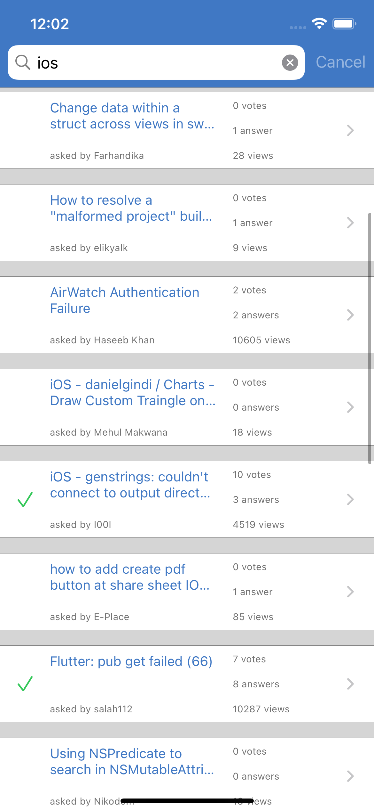
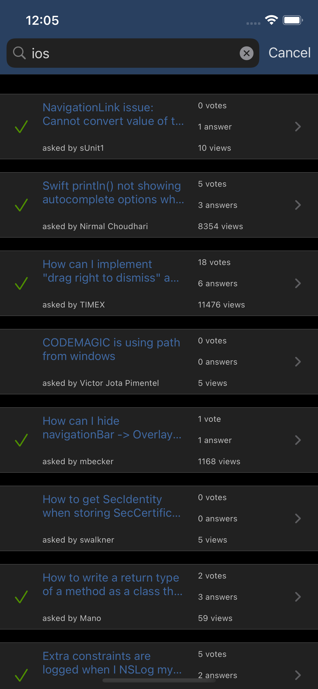
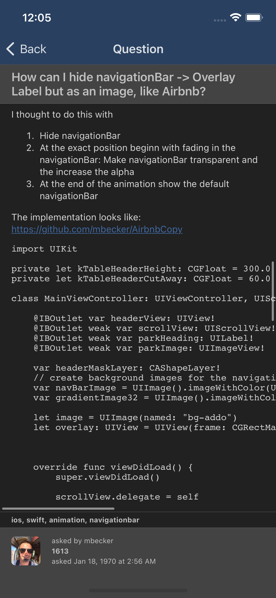

# StackOverflow

Demo application using the StackOverflow API to search for questions by tag.

Some of the concepts demonstrated in this project:
- Perform queries against a web service using a type-safe interface.
- Separation of concerns using a model and view model to separate business domain logic from presentation.
- Dark and light mode support.
- Localization, including string interpolation (variable replacement) and pluralization.
- Finite state machine for business logic and user interface use cases.
- Defining and using dynamic runtime frameworks.
- Mock web service that generates synthetic data for testing.
- Layout system for simplifying code based layouts.

This document contains an overview of the purpose of the components and how they interact. 

## Architecture

### Overview:

The code generally uses a basic Model-View-Controller design pattern for the user interface. 

The model layer consists of a Model class and a View Model class. 

The Model represents the business domain data and logic used by the application. - ie. the "raw" data used by the application.

The Model is the single source of truth in the application.

The Model by itself is not direcly usable for displaying content to the user, and so a View Model is used which observes the Model and transforms the data into a human readable format. 

The View Model also observes the user interface and performs actions based on user input, such as delegating work to the model, or performing navigation.

The View Model is essentially a data representation of the user interface.

This separation of concerns isolates the user interface from the data, and allows the logic and operations to be tested separately from the view components themselves.

The Model uses a web service to perform the actual work of sending the search request to the service provider and retrieving the results.

The sections below describe the function of each specific component in more detail.

### StackOverflow

**SceneDelegate:**

All of the components used by the application are created in the `SceneDelegate`. 

The  scene delegate instantiates the all of the dependencies, such as the model, view model, web  services, view controller, and application window.

**SearchModel:**

Models the information returned by performing a query against the web service. 

**SearchViewModel:**

The search view model is responsible for transforming the abstract data represented by the model into a form that can be displayed to a human. 

Some examples of this include converting numbers into text that can be displayed in labels, and transforming dates into localised text. 

The search view model is used by the search view controller and question view controller.

**SearchViewController:**

Allows the user to enter a query term to search for. Displays the result of the query, which may be: nothing, an error, or a list of items matching the query.

**NavigationController:**

Wraps a `UINavigationController`  to override the presentation style of the status bar. 

Used as the primary navigation controller in the application. 

**QuestionViewController:**

Displays the details of single question including information such as the title, body, and author information.  

**SearchResultTableViewCell:**

Table view cell used by the `SearchViewController` to display a search result item.

**ContentPlaceholderView:**

General purpose view used in place where content would be displayed, when the content is  not otherwise available. 

E.g. Used as the background of the search view controller to display status information until search results are available.

**BackgroundContainerView:**

General purpose view used to background display content. Animates transitions when the  content changes. 

Adjusts the view layout margins to accomodate the keyboard. Used 

**SearchBarContainerView:**

Wraps a `UISearchBar` so that it can be used in a `UINavBar`. 

This allows the search bar to be used in a av bar without affecting the height of the nav bar. 

Used by the  `SearchViewController` to display the search bar.

**URLImageView:**

General purpose view for displaying images from a URL. Loads the image and animates the  transition which the image appears.

Used by `QuestionViewController`.

**Localization:**

Helper methods used for common localization tasks, such as localizing text, or formattiing 
numbers.

**FoundationExtensions:**

Helper methods on Foundation classes. E.g. String.

**UIKitExtensions:**

Helper methods on UIKit classes. E.g. UIColor.

### StackOverflowAPI

API for interacting with the StackOverflow web services. 

Used by the `SearchModel`.

**StackOverflowQuestionsService:**

The service is defined using an abstract interface which allows for the concrete instance to be changed independently of the use case. 

An example of where this can be useful is for creating a mock object which provides tailored  data for testing purposes.

A  mock is provided for the question service, and can be seen in the scene delegate where it is commented out.

Uses `CodableTransport` to interact with the web service.

Used by `SearchModel` for performing queries.

**Timestamp:**

Simple type used for representing unix timestamps in a type-safe way. 

Used by the questions service data types.

Provides convenience methods for converting to and from Foundation `Date` types.

**CodableTransport:**

Provides a type-safe interface for interacting with web services. 

Responses are defined using objects that conform to the `Decodable` protocol. 

Used by `StackOverflowQuestionsService`.

## Layout

General purpose view components used for creating layouts using code using a declarative methodology.

The resulting code is more compact and arguably easier to read compared to using plain views and layout constraints. 

The intent is similar in spirit to SwiftUI, where the user interface is defined declaratively (what components are present) rather than imperatively (how components connect).

**MarginView:** 

Displays another view with spaces offset from the edges of the container.

**ColorView:**

Displays a view with a solid background color. 

Optionally contains other views.

**HorizontalDividerView:**

Displays a horizontal line with configurable thickness.

**ZStack:**

Displays a collection of views arranged so that they overlap the same area. i.e. orthogonal to the x and y axes.

**UIKitExtensions:**

Helper methods on UIKit components.

## Mock

Utilities used for generating data for testing, e.g. random words, sentences, numbers, booleans.

**Mock:**

Helper methods for mocking or simulating data. Used by `MockQuestionsService`.
